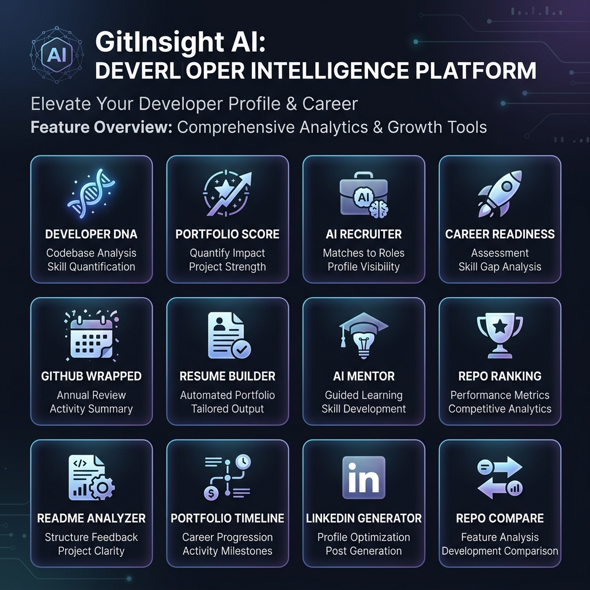
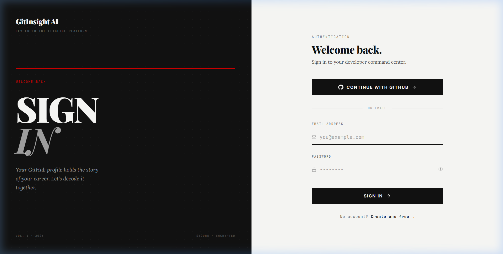
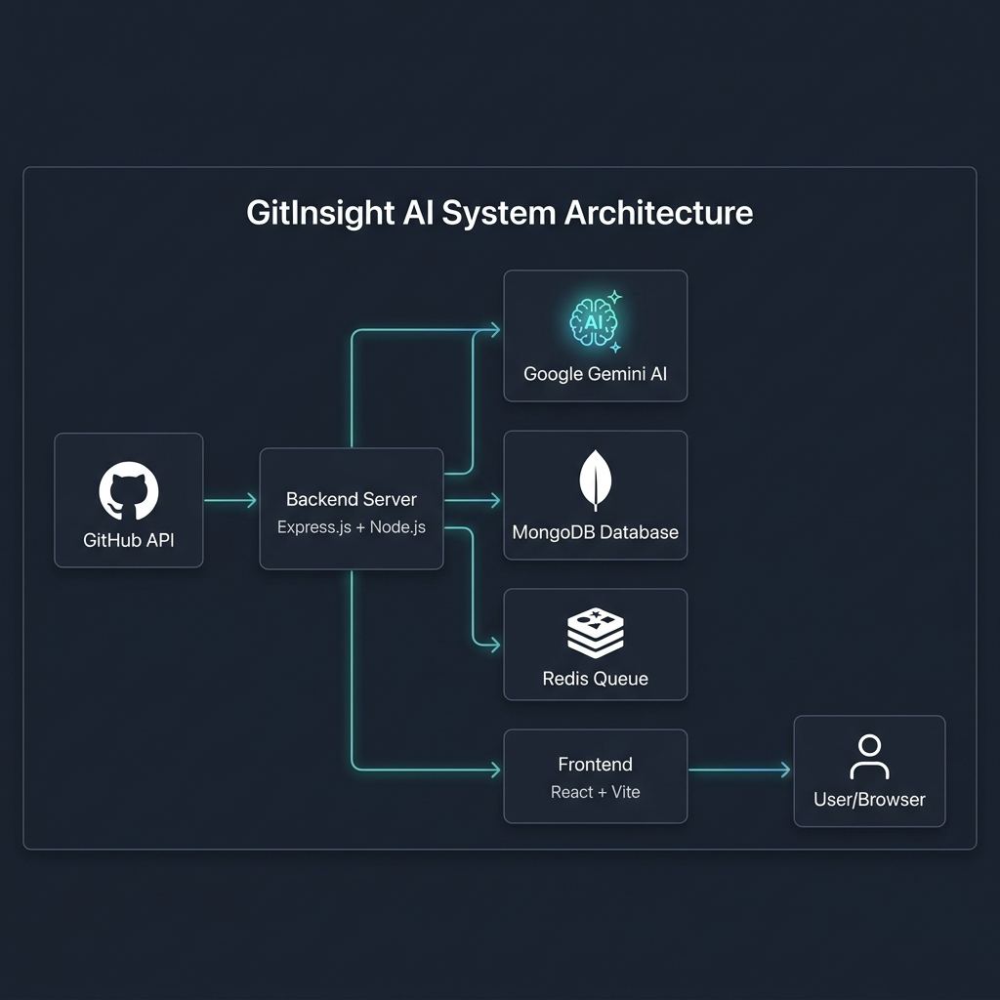
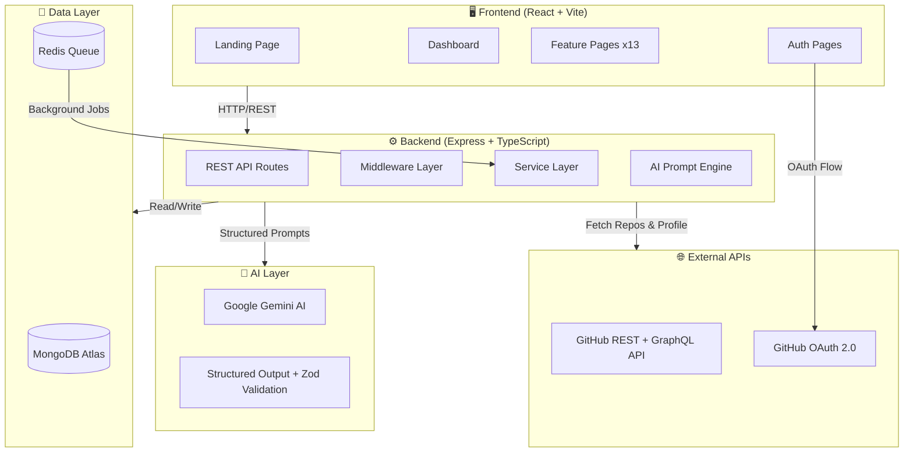
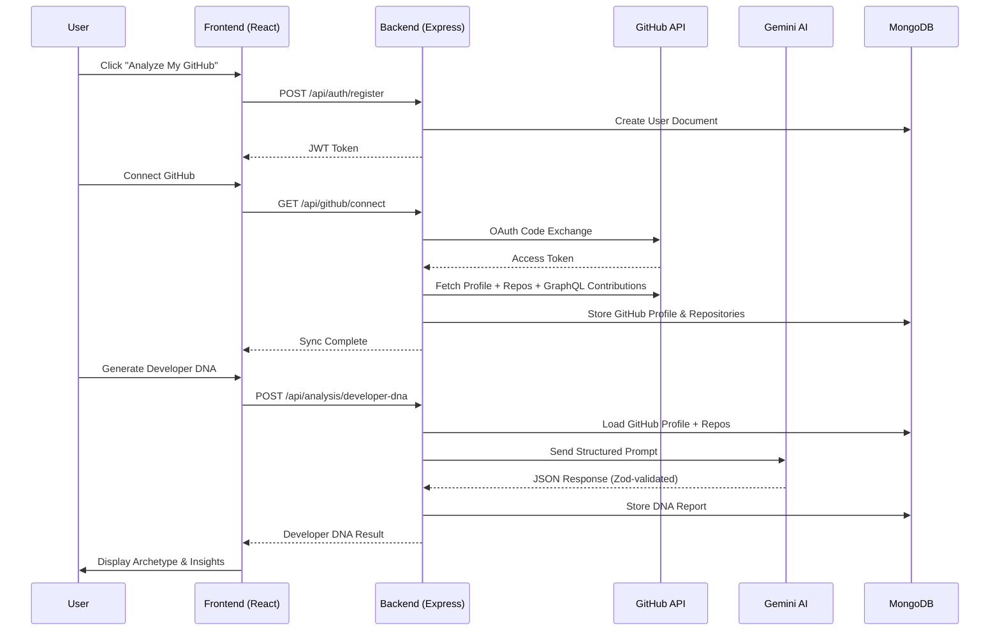
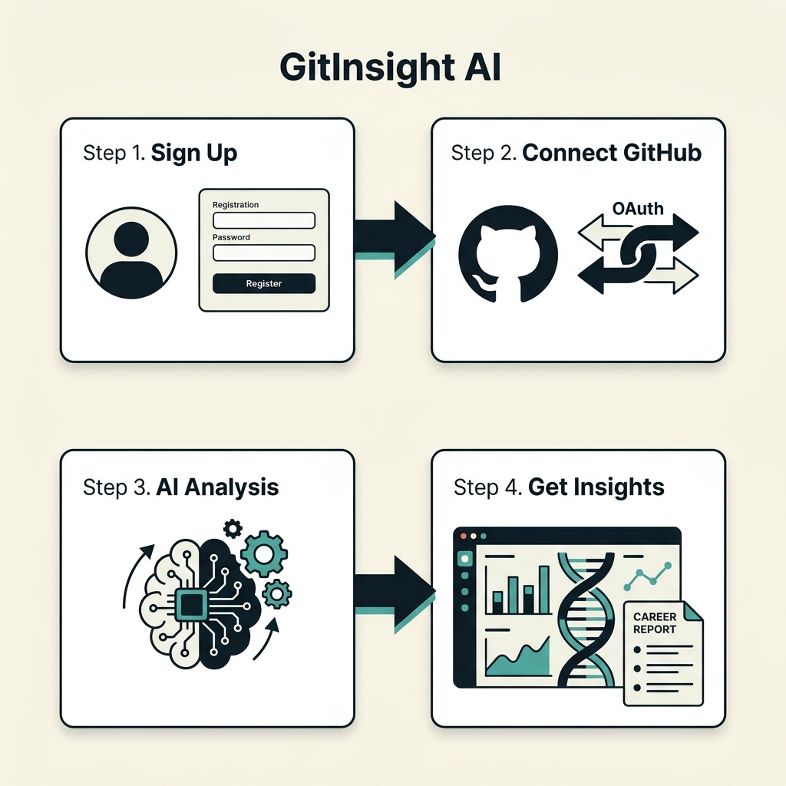
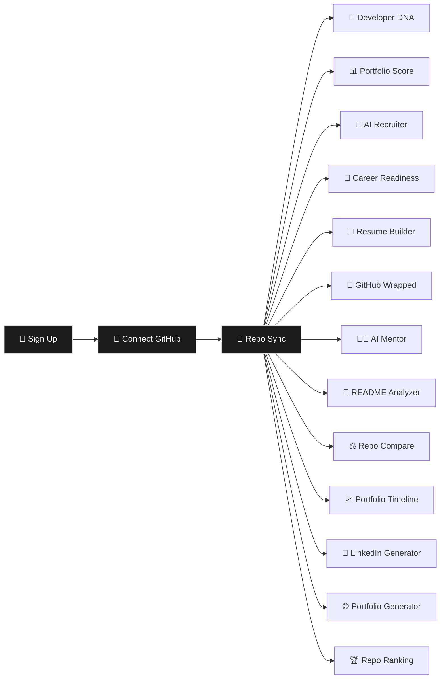
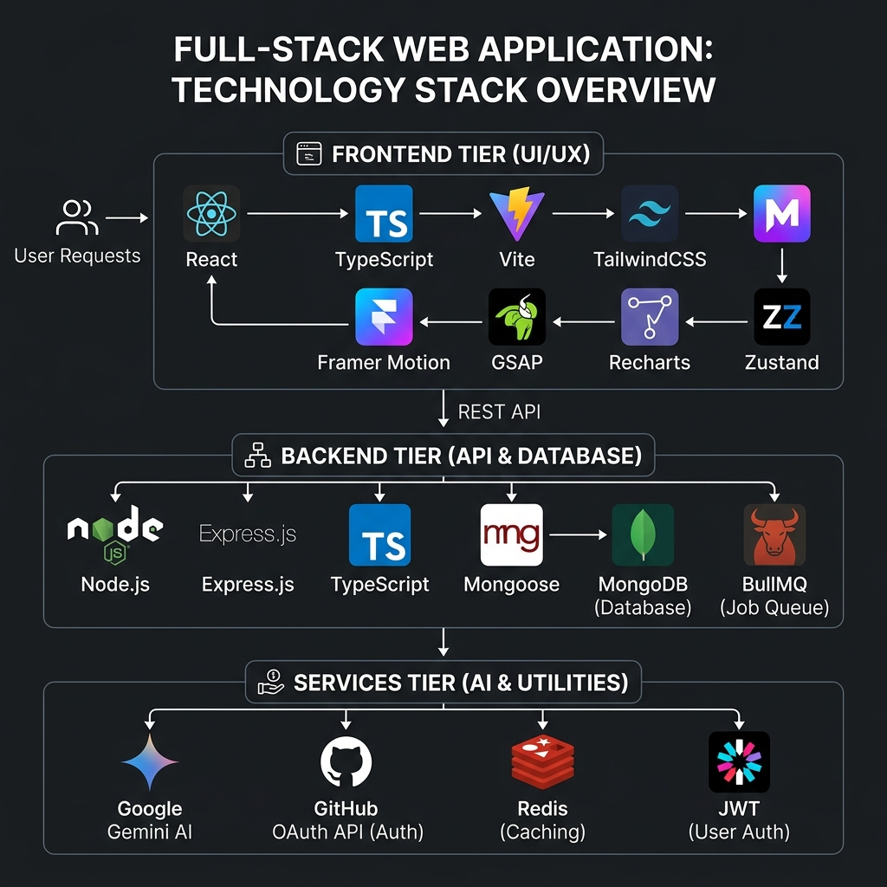
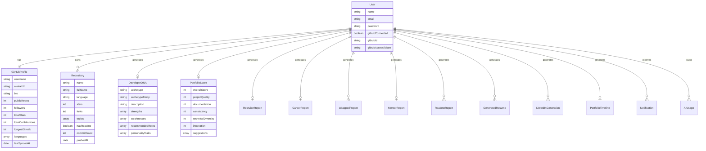

<](LICENSE)
[](https://www.typescriptlang.org/)
[](https://react.dev/)
[](https://nodejs.org/)
[](https://www.mongodb.com/)
[](https://ai.google.dev/)
[](https://redis.io/)
[](https://docs.docker.com/compose/)

<br />

**GitInsight AI** is an AI-powered developer intelligence platform that analyzes your GitHub profile, repositories, commit history, and coding patterns to generate **career-defining insights** — including your unique Developer DNA™, portfolio scores, AI recruiter simulations, career readiness reports, auto-generated resumes, and much more.

<br />

[**Get Started**](#-quick-start) · [**Features**](#-features) · [**Architecture**](#%EF%B8%8F-system-architecture) · [**API Reference**](#-api-reference) · [**Day-to-Day Uses**](#-real-world-day-to-day-use-cases) · [**Contributing**](#-contributing) · [**License**](#-license)

</div>

---

## 📖 Table of Contents

- [Why GitInsight AI?](#-why-gitinsight-ai)
- [Real-World Day-to-Day Use Cases](#-real-world-day-to-day-use-cases)
- [Features](#-features)
- [Screenshots](#-screenshots)
- [System Architecture](#️-system-architecture)
- [User Journey Workflow](#-user-journey-workflow)
- [Tech Stack](#-tech-stack)
- [Project Structure](#-project-structure)
- [Quick Start](#-quick-start)
- [Environment Variables](#-environment-variables)
- [API Reference](#-api-reference)
- [Data Models](#-data-models)
- [Deployment](#-deployment)
- [Security](#-security)
- [Performance](#-performance)
- [Roadmap](#-roadmap)
- [Contributing](#-contributing)
- [License](#-license)
- [Acknowledgments](#-acknowledgments)

---

## 🤔 Why GitInsight AI?

> *"Most developers don't know their own story. Your work tells a powerful narrative. You just can't see it yet."*

Every developer spends **thousands of hours** writing code — late nights, weekends, coffee-fueled debugging sessions. Yet when it matters most — during a **job search** — all that hard work gets reduced to a list of repository names and star counts.

**Recruiters at top companies spend an average of 6 seconds reviewing a GitHub profile.** Without a system that translates your technical depth into recruiter-friendly signals, your best work remains invisible.

### The Problem

| Challenge | Description |
|-----------|-------------|
| 🔍 **Invisible Work** | Your best coding patterns, architectural decisions, and growth trajectory are buried in commits |
| 📉 **No Quantification** | There's no standardized way to measure or score a developer's portfolio quality |
| 🤷 **Blind Spots** | Developers don't know how recruiters perceive their profiles |
| 📄 **Resume Gap** | Traditional resumes fail to capture the depth of open-source contributions |
| 🎯 **Career Uncertainty** | No clear, data-driven way to assess readiness for target roles |

### The Solution

**GitInsight AI bridges the gap** between your raw GitHub activity and the career intelligence you need. It uses **Google Gemini AI** to perform deep analysis of your repositories, commit patterns, language distribution, and project architectures — then translates everything into actionable career insights.

---

## 🌍 Real-World Day-to-Day Use Cases

GitInsight AI is not just another developer tool — it's a **career companion** designed to be part of your daily workflow. Here's how people use it every day:

### 👨‍💻 For Developers

| Use Case | How It Helps | Feature Used |
|----------|-------------|--------------|
| **Morning Portfolio Check** | Start your day by reviewing your portfolio score — see if recent commits improved your standing | Portfolio Score |
| **Pre-Interview Preparation** | Run an AI Recruiter simulation before interviews to know exactly how hiring managers perceive your profile | AI Recruiter |
| **Weekly Career Checkpoint** | Check your Career Readiness Report every week to track progress toward your target role | Career Readiness |
| **Resume Updates** | Auto-generate an ATS-optimized resume every time you ship a new project — no manual formatting needed | Resume Builder |
| **LinkedIn Content Creation** | Generate professional LinkedIn posts about your latest projects with one click | LinkedIn Generator |
| **Project Documentation** | Analyze and improve your README files for every new repo before sharing | README Analyzer |
| **Learning Path Planning** | Get personalized AI Mentor recommendations on what technologies to learn next | AI Mentor |

### 🏢 For Hiring Managers & Recruiters

| Use Case | How It Helps | Feature Used |
|----------|-------------|--------------|
| **Candidate Screening** | Quickly assess a candidate's portfolio quality, consistency, and technical diversity | Portfolio Score |
| **Technical Depth Assessment** | Understand a developer's true archetype and coding personality beyond the resume | Developer DNA™ |
| **Comparative Analysis** | Compare two candidate repositories side-by-side with AI-powered scoring | Repo Compare |

### 🎓 For Students & Bootcamp Graduates

| Use Case | How It Helps | Feature Used |
|----------|-------------|--------------|
| **Track Growth Over Time** | Visualize your entire coding journey from first commit to latest project | Portfolio Timeline |
| **Identify Skill Gaps** | Know exactly which skills to learn for your dream role | Career Readiness |
| **Year in Review** | Share your annual GitHub Wrapped with peers and on social media | GitHub Wrapped |
| **Portfolio Website Content** | Auto-generate professional portfolio website copy from your GitHub data | Portfolio Generator |

### 📅 Daily Workflow Integration

```
┌─────────────────────────────────────────────────────────┐
│                    DEVELOPER'S DAY                       │
├──────────┬──────────────────────────────────────────────┤
│ Morning  │ ☕ Check Portfolio Score → Review overnight   │
│          │    changes → Identify areas to improve        │
├──────────┼──────────────────────────────────────────────┤
│ Midday   │ 🔧 Push new code → README Analyzer ensures   │
│          │    documentation is top-tier                   │
├──────────┼──────────────────────────────────────────────┤
│ Afternoon│ 📊 AI Mentor suggests next learning topics    │
│          │    → Career Readiness tracks progress          │
├──────────┼──────────────────────────────────────────────┤
│ Evening  │ 📝 Generate LinkedIn post about today's       │
│          │    shipped feature → Share with network        │
├──────────┼──────────────────────────────────────────────┤
│ Weekly   │ 🎯 AI Recruiter simulation → Know your        │
│          │    hiring probability → Adjust strategy        │
└──────────┴──────────────────────────────────────────────┘
```

---

## ✨ Features

<div align="center">

</div>

<br />

GitInsight AI comes with **13 powerful AI-driven features**, each designed to give you a different dimension of career intelligence:

### 🧬 1. Developer DNA™
> *Six developer archetypes. Infinite self-knowledge.*

AI analyzes your commit patterns, project diversity, language distribution, and architectural choices to identify your unique developer archetype — from **The AI Builder** to **The Open Source Crusader**. This isn't a quiz — it's deep code archaeology based on 200+ signals.

**Output includes:** Archetype name, personality traits, strengths, weaknesses, recommended roles, compatible archetypes, and career trajectory.

### 📊 2. Portfolio Score
> *A single number. Backed by fifty signals.*

Your entire GitHub portfolio, scored across **5 dimensions**:
- **Project Quality** — Code structure, complexity, and impact
- **Documentation** — README quality, inline comments, descriptions
- **Consistency** — Commit frequency, contribution patterns
- **Technical Diversity** — Language breadth, framework usage
- **Innovation** — Project originality and problem-solving approach

### 🎯 3. AI Recruiter Simulation
> *Know your odds before you apply.*

Simulates the decision-making process of top technical recruiters at FAANG and high-growth startups. See your profile **exactly how they see it** — including the silent disqualifiers most developers never know about.

**Output includes:** Verdict (Strong Hire / Lean Hire / No Hire), hiring probability, technical evaluation, communication evaluation, portfolio evaluation, and perspectives from senior engineers and startup CTOs.

### 🚀 4. Career Readiness Report
> *Role-specific readiness. No guesswork.*

Specify your target role (Senior Fullstack, ML Engineer, Staff Frontend, etc.) and get a detailed readiness report with:
- Match percentage per role
- Specific skill gaps to close
- Hiring readiness level
- 90-day actionable roadmap
- Growth opportunities

### 📄 5. Resume Builder
> *ATS-optimized. GitHub-powered.*

Generates a recruiter-ready, **ATS-optimized resume** directly from your GitHub activity. Supports multiple formats:
- `ats` — Maximum ATS compatibility
- `fullstack` — Full-stack developer focus
- `frontend` — Frontend specialist focus
- `ai` — AI/ML engineer focus

Each resume comes with a **Resume Score** and recruiter optimization tips.

### 🎉 6. GitHub Wrapped
> *Spotify Wrapped. For your code.*

A cinematic retrospective of your year in code. Includes:
- Projects built
- Total commits
- Stars earned
- Most active month
- Favorite language
- Developer personality of the year
- Highlight moments

### 🏆 7. Repository Ranking
Rank all your repositories by quality, complexity, and recruiter value. Identify your strongest projects and the ones that need improvement.

### 📝 8. README Analyzer
Deep-analysis of any repository's README with:
- Quality score (0-100)
- Health score
- Missing sections detection
- Improvement suggestions
- **AI-enhanced README generation**

### 🧑‍🏫 9. AI Mentor
Your personal AI coding mentor that provides:
- Current developer level assessment
- Personalized learning roadmap (phased)
- Recommended technologies to learn
- Project ideas tailored to your growth
- Weekly goals and monthly milestones

### ⚖️ 10. Repository Compare
Compare any two of your repositories head-to-head across:
- Complexity, Innovation, Documentation
- Recruiter value & resume worthiness
- Technical depth analysis
- AI-generated verdict

### 📈 11. Portfolio Timeline
Visualize your entire coding journey as a **chronological timeline** with:
- Project milestones
- Technology evolution by year
- Achievement markers

### 💼 12. LinkedIn Generator
AI-generated, professional LinkedIn posts tailored to your GitHub activity. Generate content for:
- Project launches
- Tech stack showcases
- Career milestones
- Open-source contributions

### 🌐 13. Portfolio Generator
Auto-generate professional portfolio website content including:
- Hero section copy
- About section with story
- Skills categorization
- Project descriptions with impact
- Professional summary and GitHub bio

---

## 📸 Screenshots

<div align="center">

### Landing Page — Newspaper-Inspired Design


<br /><br />

### Dashboard — Command Center


</div>

---

## 🏗️ System Architecture

<div align="center">

</div>

<br />

### High-Level Architecture Diagram



### Request Flow



---

## 🚶 User Journey Workflow

<div align="center">

</div>

<br />



---

## 🔧 Tech Stack

<div align="center">

</div>

<br />

### Frontend

| Technology | Version | Purpose |
|-----------|---------|---------|
| **React** | 19.x | UI Component Library |
| **TypeScript** | 6.x | Type Safety |
| **Vite** | 8.x | Build Tool & Dev Server |
| **TailwindCSS** | 4.x | Utility-First CSS |
| **Framer Motion** | 12.x | Animations & Transitions |
| **GSAP** | 3.x | Advanced Scroll Animations |
| **Recharts** | 3.x | Data Visualization & Charts |
| **Zustand** | 5.x | State Management |
| **React Router** | 7.x | Client-Side Routing |
| **Axios** | 1.x | HTTP Client |
| **Lucide React** | 1.x | Icon Library |
| **React Query** | 5.x | Server State Management |
| **html2canvas + jsPDF** | — | PDF Export |
| **Lenis** | 1.x | Smooth Scrolling |

### Backend

| Technology | Version | Purpose |
|-----------|---------|---------|
| **Node.js** | 20+ | Runtime Environment |
| **Express.js** | 4.x | Web Framework |
| **TypeScript** | 5.x | Type Safety |
| **Mongoose** | 8.x | MongoDB ODM |
| **BullMQ** | 5.x | Background Job Queue |
| **Zod** | 3.x | Runtime Schema Validation |
| **JWT** | 9.x | Authentication Tokens |
| **Helmet** | 7.x | HTTP Security Headers |
| **bcryptjs** | 2.x | Password Hashing |
| **express-rate-limit** | 7.x | Rate Limiting |

### Services & Infrastructure

| Service | Purpose |
|---------|---------|
| **Google Gemini AI** | Structured AI analysis & generation |
| **GitHub REST API** | Repository & profile data fetching |
| **GitHub GraphQL API** | Contribution calendar & streaks |
| **GitHub OAuth 2.0** | Secure user authentication |
| **MongoDB Atlas** | Primary database |
| **Redis** | Job queue & caching |
| **Docker Compose** | Container orchestration |
| **Render.com** | Cloud deployment |

---

## 📁 Project Structure

```
GITINSIGHT AI/
├── 📄 README.md                  # This file
├── 📄 LICENSE                    # MIT License
├── 📄 docker-compose.yml         # Docker orchestration
├── 📄 render.yaml                # Render.com deployment config
├── 📄 .gitignore                 # Git ignore rules
│
├── 📂 backend/                   # Express.js API Server
│   ├── 📄 package.json
│   ├── 📄 tsconfig.json
│   ├── 📄 Dockerfile
│   ├── 📄 .env.example
│   └── 📂 src/
│       ├── 📄 app.ts             # Express app configuration
│       ├── 📄 server.ts          # Server entry point
│       ├── 📂 config/            # Environment & database config
│       ├── 📂 middleware/        # Auth & error middleware
│       │   ├── auth.middleware.ts
│       │   └── error.middleware.ts
│       ├── 📂 models/            # Mongoose schemas (17 models)
│       │   ├── User.ts
│       │   ├── GitHubProfile.ts
│       │   ├── Repository.ts
│       │   ├── DeveloperDNA.ts
│       │   ├── PortfolioScore.ts
│       │   ├── RecruiterReport.ts
│       │   ├── CareerReport.ts
│       │   ├── WrappedReport.ts
│       │   ├── MentorReport.ts
│       │   ├── ReadmeReport.ts
│       │   ├── GeneratedResume.ts
│       │   ├── LinkedInGeneration.ts
│       │   ├── PortfolioTimeline.ts
│       │   ├── PublicProfile.ts
│       │   ├── Notification.ts
│       │   ├── AIUsage.ts
│       │   └── UserAnalytics.ts
│       ├── 📂 routes/            # API route handlers
│       │   ├── auth.routes.ts
│       │   ├── github.routes.ts
│       │   ├── analysis.routes.ts
│       │   ├── notifications.routes.ts
│       │   ├── user.routes.ts
│       │   ├── jobs.routes.ts
│       │   └── config.routes.ts
│       ├── 📂 services/          # Business logic
│       │   ├── analysis.service.ts    # All 12 AI analysis functions
│       │   ├── auth.service.ts        # JWT & auth logic
│       │   ├── github.service.ts      # GitHub API integration
│       │   ├── notification.service.ts
│       │   └── 📂 ai/
│       │       ├── gemini.service.ts   # Google Gemini integration
│       │       └── tokenTracker.ts     # AI usage tracking
│       ├── 📂 prompts/           # AI prompt templates (12 files)
│       │   ├── developerDNA.prompt.ts
│       │   ├── portfolio.prompt.ts
│       │   ├── recruiter.prompt.ts
│       │   ├── career.prompt.ts
│       │   ├── wrapped.prompt.ts
│       │   ├── mentor.prompt.ts
│       │   ├── timeline.prompt.ts
│       │   ├── portfolioGenerator.prompt.ts
│       │   ├── readme.prompt.ts
│       │   ├── linkedin.prompt.ts
│       │   ├── resume.prompt.ts
│       │   └── repositoryCompare.prompt.ts
│       └── 📂 jobs/              # BullMQ background jobs
│
├── 📂 frontend/                  # React + Vite SPA
│   ├── 📄 package.json
│   ├── 📄 vite.config.ts
│   ├── 📄 index.html
│   └── 📂 src/
│       ├── 📄 App.tsx            # Router & layout configuration
│       ├── 📄 main.tsx           # Entry point
│       ├── 📄 index.css          # Global styles & design system
│       ├── 📂 components/
│       │   ├── 📂 layout/        # AuthLayout, ProtectedRoute, HeroSection
│       │   ├── 📂 ui/            # Reusable UI components
│       │   ├── 📂 notifications/ # Notification center
│       │   ├── 📂 command/       # Command palette (⌘K)
│       │   └── 📂 three/         # Three.js 3D components
│       ├── 📂 pages/
│       │   ├── 📂 landing/       # Public landing page
│       │   ├── 📂 auth/          # Login & Register
│       │   ├── 📂 onboarding/    # Welcome, Connect GitHub, Sync
│       │   ├── 📂 dashboard/     # Main dashboard
│       │   ├── 📂 features/      # 13 feature pages
│       │   │   ├── developer-dna/
│       │   │   ├── portfolio-score/
│       │   │   ├── ai-recruiter/
│       │   │   ├── career-readiness/
│       │   │   ├── github-wrapped/
│       │   │   ├── resume-builder/
│       │   │   ├── ai-mentor/
│       │   │   ├── repository-ranking/
│       │   │   ├── readme-analyzer/
│       │   │   ├── repository-compare/
│       │   │   ├── portfolio-timeline/
│       │   │   ├── linkedin-generator/
│       │   │   └── portfolio-generator/
│       │   └── 📂 settings/      # User settings
│       ├── 📂 services/          # API client services
│       ├── 📂 store/             # Zustand state stores
│       └── 📂 types/             # TypeScript type definitions
│
└── 📂 docs/
    └── 📂 screenshots/           # Documentation images
```

---

## 🚀 Quick Start

### Prerequisites

- **Node.js** 20+ and **npm** 10+
- **MongoDB** (local or [Atlas](https://cloud.mongodb.com/))
- **Redis** 7+ (local or cloud)
- **GitHub OAuth App** ([create one](https://github.com/settings/developers))
- **Google Gemini API Key** ([get one](https://ai.google.dev/))

### Option 1: Docker Compose (Recommended)

```bash
# 1. Clone the repository
git clone https://github.com/COZYkrish/GITINSIGHT-AI.git
cd GITINSIGHT-AI

# 2. Create environment file
cp backend/.env.example backend/.env
# Edit backend/.env with your credentials

# 3. Start all services
docker-compose up -d

# 4. Open in browser
# Frontend: http://localhost:5173
# Backend:  http://localhost:5000
# Health:   http://localhost:5000/health
```

### Option 2: Manual Setup

```bash
# 1. Clone the repository
git clone https://github.com/COZYkrish/GITINSIGHT-AI.git
cd GITINSIGHT-AI

# 2. Setup Backend
cd backend
cp .env.example .env
# Edit .env with your credentials (see Environment Variables section)
npm install
npm run dev

# 3. Setup Frontend (in a new terminal)
cd frontend
cp .env.example .env
# Set VITE_API_URL=http://localhost:5000
npm install
npm run dev

# 4. Open http://localhost:5173 in your browser
```

### Verify Installation

```bash
# Check backend health
curl http://localhost:5000/health

# Expected response:
# { "status": "ok", "version": "1.0.0", "timestamp": "2026-06-08T..." }
```

---

## 🔑 Environment Variables

### Backend (`backend/.env`)

| Variable | Required | Description | Example |
|----------|----------|-------------|---------|
| `NODE_ENV` | ✅ | Environment mode | `development` |
| `PORT` | ✅ | Server port | `5000` |
| `MONGODB_URI` | ✅ | MongoDB connection string | `mongodb+srv://...` |
| `JWT_SECRET` | ✅ | JWT signing secret (min 32 chars) | `your-super-secret-key-here` |
| `GITHUB_CLIENT_ID` | ✅ | GitHub OAuth App Client ID | `Iv1.abc123...` |
| `GITHUB_CLIENT_SECRET` | ✅ | GitHub OAuth App Client Secret | `ghs_abc123...` |
| `GEMINI_API_KEY` | ✅ | Google Gemini API Key | `AIzaSy...` |
| `REDIS_URL` | ✅ | Redis connection URL | `redis://localhost:6379` |
| `FRONTEND_URL` | ✅ | Frontend origin for CORS | `http://localhost:5173` |
| `ENABLE_BACKGROUND_JOBS` | ⬜ | Enable BullMQ job processing | `true` |
| `ENABLE_DEVELOPER_DNA` | ⬜ | Feature flag: Developer DNA | `true` |
| `ENABLE_RESUME_BUILDER` | ⬜ | Feature flag: Resume Builder | `true` |
| `ENABLE_PORTFOLIO_GENERATOR` | ⬜ | Feature flag: Portfolio Generator | `true` |
| `ENABLE_GITHUB_WRAPPED` | ⬜ | Feature flag: GitHub Wrapped | `true` |
| `ENABLE_REPO_COMPARE` | ⬜ | Feature flag: Repository Compare | `true` |
| `ENABLE_PUBLIC_PROFILES` | ⬜ | Feature flag: Public Profiles | `true` |
| `ENABLE_SOCIAL_SHARING` | ⬜ | Feature flag: Social Sharing | `true` |

### Frontend (`frontend/.env`)

| Variable | Required | Description | Example |
|----------|----------|-------------|---------|
| `VITE_API_URL` | ✅ | Backend API base URL | `http://localhost:5000` |

---

## 📡 API Reference

### Authentication

| Method | Endpoint | Description | Auth |
|--------|----------|-------------|------|
| `POST` | `/api/auth/register` | Register new account | ❌ |
| `POST` | `/api/auth/login` | Login with credentials | ❌ |
| `GET` | `/api/auth/me` | Get current user | 🔐 |

### GitHub Integration

| Method | Endpoint | Description | Auth |
|--------|----------|-------------|------|
| `GET` | `/api/github/connect` | Initiate GitHub OAuth | 🔐 |
| `GET` | `/api/github/callback` | OAuth callback handler | 🔐 |
| `GET` | `/api/github/profile` | Get cached GitHub profile | 🔐 |
| `GET` | `/api/github/repos` | Get synced repositories | 🔐 |

### AI Analysis

| Method | Endpoint | Description | Auth | Rate Limit |
|--------|----------|-------------|------|------------|
| `POST` | `/api/analysis/developer-dna` | Generate Developer DNA™ | 🔐 | 500/hr |
| `POST` | `/api/analysis/portfolio-score` | Generate Portfolio Score | 🔐 | 500/hr |
| `POST` | `/api/analysis/recruiter` | Run AI Recruiter Simulation | 🔐 | 500/hr |
| `POST` | `/api/analysis/career` | Generate Career Readiness | 🔐 | 500/hr |
| `POST` | `/api/analysis/wrapped` | Generate GitHub Wrapped | 🔐 | 500/hr |
| `POST` | `/api/analysis/mentor` | Generate AI Mentor Report | 🔐 | 500/hr |
| `POST` | `/api/analysis/readme` | Analyze Repository README | 🔐 | 500/hr |
| `POST` | `/api/analysis/resume` | Generate ATS Resume | 🔐 | 500/hr |
| `POST` | `/api/analysis/linkedin` | Generate LinkedIn Content | 🔐 | 500/hr |
| `POST` | `/api/analysis/timeline` | Generate Portfolio Timeline | 🔐 | 500/hr |
| `POST` | `/api/analysis/portfolio-generator` | Generate Portfolio Content | 🔐 | 500/hr |
| `POST` | `/api/analysis/compare` | Compare Two Repositories | 🔐 | 500/hr |
| `GET` | `/api/analysis/developer-dna` | Get saved Developer DNA | 🔐 | — |
| `GET` | `/api/analysis/portfolio-score` | Get saved Portfolio Score | 🔐 | — |
| `GET` | `/api/analysis/recruiter` | Get saved Recruiter Report | 🔐 | — |

### Notifications

| Method | Endpoint | Description | Auth |
|--------|----------|-------------|------|
| `GET` | `/api/notifications` | Get user notifications | 🔐 |
| `PATCH` | `/api/notifications/:id/read` | Mark notification as read | 🔐 |

---

## 📦 Data Models



---

## ☁️ Deployment

### Render.com (Included Config)

The project includes a `render.yaml` for one-click deployment to [Render.com](https://render.com):

```yaml
# Deploys:
# 1. Backend (Node.js Web Service) — Singapore region
# 2. Frontend (Static Site) — Global CDN
# 3. Redis (Managed Instance) — Singapore region
```

**Steps:**
1. Fork this repository
2. Connect your GitHub to Render
3. Click "New Blueprint Instance"
4. Select this repo → Render auto-detects `render.yaml`
5. Set environment variables (MongoDB URI, GitHub OAuth, Gemini API Key)
6. Deploy 🚀

### Docker Compose (Self-Hosted)

```bash
# Production deployment
docker-compose up -d --build

# View logs
docker-compose logs -f

# Scale backend
docker-compose up -d --scale backend=3
```

### Manual Deployment

```bash
# Build backend
cd backend && npm run build
NODE_ENV=production node dist/server.js

# Build frontend
cd frontend && npm run build
# Serve dist/ folder with any static server (nginx, Vercel, Netlify)
```

---

## 🔒 Security

GitInsight AI implements multiple layers of security:

| Layer | Implementation |
|-------|---------------|
| **Authentication** | JWT tokens with secure signing (jsonwebtoken) |
| **Password Hashing** | bcryptjs with salt rounds |
| **HTTP Headers** | Helmet.js (CSP, HSTS, X-Frame-Options, etc.) |
| **Rate Limiting** | Global (200/15min), Auth (100/15min), AI (500/hr) |
| **CORS** | Strict origin validation |
| **Input Sanitization** | Express Mongo Sanitize (NoSQL injection prevention) |
| **Request Size** | 10KB body limit |
| **OAuth** | GitHub OAuth 2.0 (no password storage for GitHub auth) |
| **Schema Validation** | Zod runtime validation on all AI outputs |

---

## ⚡ Performance

| Feature | Implementation |
|---------|---------------|
| **GitHub Data Caching** | 24-hour TTL cache (avoids redundant API calls) |
| **Background Jobs** | BullMQ + Redis for async AI processing |
| **AI Fallbacks** | Every AI analysis has hardcoded fallback data to prevent failures |
| **Structured Output** | Zod schema validation ensures consistent AI responses |
| **Token Tracking** | All Gemini API usage is tracked per user and analysis type |
| **Pagination** | GitHub repos fetched in batches of 100 |
| **Frontend Code Splitting** | Vite automatic chunking |
| **Smooth Scrolling** | Lenis library for 60fps scroll performance |

---

## 🗺️ Roadmap

- [x] Core 13 AI features
- [x] GitHub OAuth integration
- [x] Newspaper-inspired landing page design
- [x] Dashboard with command center
- [x] Real-time notifications
- [x] Command palette (⌘K)
- [x] Docker Compose support
- [x] Render.com deployment config
- [ ] Public shareable profiles
- [ ] Team analytics
- [ ] VS Code extension
- [ ] GitHub Actions integration
- [ ] Mobile responsive optimization
- [ ] Multi-language support (i18n)
- [ ] Webhook-based auto-analysis on push
- [ ] Custom branding for teams
- [ ] Export reports as PDF
- [ ] Competitive benchmarking against other developers

---

## 🤝 Contributing

Contributions are welcome! Here's how to get started:

### Development Setup

```bash
# 1. Fork & clone
git clone https://github.com/YOUR_USERNAME/GITINSIGHT-AI.git
cd GITINSIGHT-AI

# 2. Install dependencies
cd backend && npm install
cd ../frontend && npm install

# 3. Setup environment
cp backend/.env.example backend/.env
cp frontend/.env.example frontend/.env
# Fill in your credentials

# 4. Start development
# Terminal 1: Backend
cd backend && npm run dev

# Terminal 2: Frontend
cd frontend && npm run dev
```

### Contribution Guidelines

1. **Fork** the repository
2. Create a **feature branch** (`git checkout -b feature/amazing-feature`)
3. **Commit** your changes (`git commit -m 'Add amazing feature'`)
4. **Push** to the branch (`git push origin feature/amazing-feature`)
5. Open a **Pull Request**

### Code Standards

- TypeScript strict mode
- ESLint for linting
- Consistent naming: `camelCase` for variables, `PascalCase` for components
- Every AI analysis must include Zod schema + fallback data
- Every route must have auth middleware where appropriate
- All services follow the `generate*` naming convention

---

## 📄 License

```
MIT License

Copyright (c) 2026 GitInsight AI — COZYkrish

Permission is hereby granted, free of charge, to any person obtaining a copy
of this software and associated documentation files (the "Software"), to deal
in the Software without restriction, including without limitation the rights
to use, copy, modify, merge, publish, distribute, sublicense, and/or sell
copies of the Software, and to permit persons to whom the Software is
furnished to do so, subject to the following conditions:

The above copyright notice and this permission notice shall be included in all
copies or substantial portions of the Software.

THE SOFTWARE IS PROVIDED "AS IS", WITHOUT WARRANTY OF ANY KIND, EXPRESS OR
IMPLIED, INCLUDING BUT NOT LIMITED TO THE WARRANTIES OF MERCHANTABILITY,
FITNESS FOR A PARTICULAR PURPOSE AND NONINFRINGEMENT. IN NO EVENT SHALL THE
AUTHORS OR COPYRIGHT HOLDERS BE LIABLE FOR ANY CLAIM, DAMAGES OR OTHER
LIABILITY, WHETHER IN AN ACTION OF CONTRACT, TORT OR OTHERWISE, ARISING FROM,
OUT OF OR IN CONNECTION WITH THE SOFTWARE OR THE USE OR OTHER DEALINGS IN THE
SOFTWARE.
```

---

## 🙏 Acknowledgments

- [**Google Gemini AI**](https://ai.google.dev/) — Powers all 12+ AI analysis features with structured output
- [**GitHub API**](https://docs.github.com/en/rest) — REST & GraphQL APIs for developer data
- [**React**](https://react.dev/) — Frontend UI framework
- [**Framer Motion**](https://www.framer.com/motion/) — Smooth animations and transitions
- [**GSAP**](https://greensock.com/gsap/) — Advanced scroll-triggered animations
- [**Recharts**](https://recharts.org/) — Data visualization charts
- [**Zustand**](https://zustand-demo.pmnd.rs/) — Lightweight state management
- [**BullMQ**](https://docs.bullmq.io/) — Redis-based job queue
- [**Zod**](https://zod.dev/) — Runtime type validation for AI outputs
- [**Vite**](https://vitejs.dev/) — Lightning-fast frontend build tool

---

<div align="center">

### Built with ❤️ by [COZYkrish](https://github.com/COZYkrish)

**GitInsight AI** — *The career intelligence platform for developers who take their work seriously.*

<br />

*Established 2026 · Vol. 1 · Developer Intelligence Platform*

<br />

[](https://github.com/COZYkrish/GITINSIGHT-AI)
[](https://github.com/COZYkrish)

</div>
]]>
