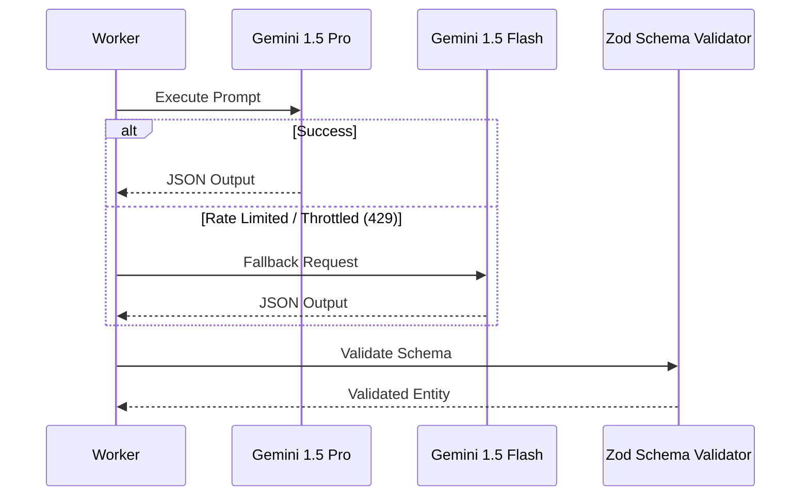

# AI Prompt Orchestration Sequence Diagram

```mermaid
sequenceDiagram
    participant Worker
    participant GeminiPro as Gemini 1.5 Pro
    participant GeminiFlash as Gemini 1.5 Flash
    participant Validator as Zod Schema Validator

    Worker->>GeminiPro: Execute Prompt
    alt Success
        GeminiPro-->>Worker: JSON Output
    else Rate Limited / Throttled (429)
        Worker->>GeminiFlash: Fallback Request
        GeminiFlash-->>Worker: JSON Output
    end
    Worker->>Validator: Validate Schema
    Validator-->>Worker: Validated Entity
```
