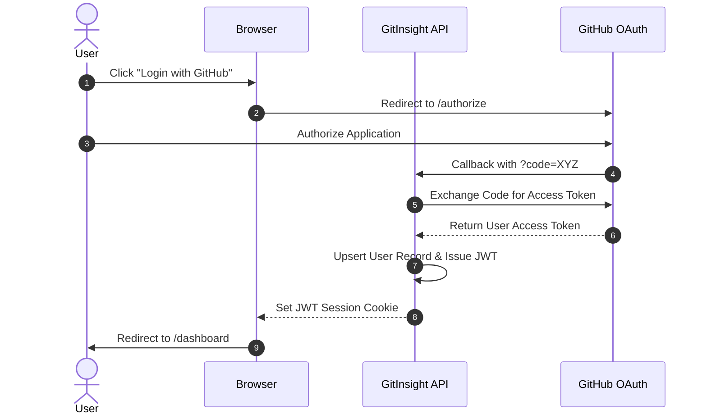

# User Authentication & OAuth Flowchart

```mermaid
sequenceDiagram
    autonumber
    actor User
    participant Browser
    participant API as GitInsight API
    participant GitHub as GitHub OAuth

    User->>Browser: Click "Login with GitHub"
    Browser->>GitHub: Redirect to /authorize
    User->>GitHub: Authorize Application
    GitHub->>API: Callback with ?code=XYZ
    API->>GitHub: Exchange Code for Access Token
    GitHub-->>API: Return User Access Token
    API->>API: Upsert User Record & Issue JWT
    API-->>Browser: Set JWT Session Cookie
    Browser->>User: Redirect to /dashboard
```
