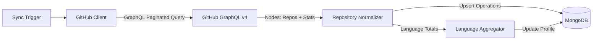

# GitHub GraphQL Synchronization Diagram

```mermaid
graph LR
    SyncTrigger[Sync Trigger] --> Client[GitHub Client]
    Client -->|GraphQL Paginated Query| GraphQL[GitHub GraphQL v4]
    GraphQL -->|Nodes: Repos + Stats| Parser[Repository Normalizer]
    Parser -->|Upsert Operations| Mongo[(MongoDB)]
    Parser -->|Language Totals| Aggregator[Language Aggregator]
    Aggregator -->|Update Profile| Mongo
```
