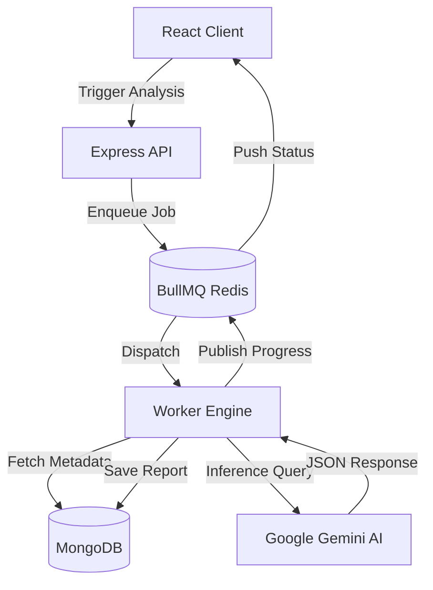

# Data Pipeline & Queue Flowcharts

```mermaid
graph TD
    Client[React Client] -->|Trigger Analysis| Express[Express API]
    Express -->|Enqueue Job| Redis[(BullMQ Redis)]
    Redis -->|Dispatch| Worker[Worker Engine]
    Worker -->|Fetch Metadata| Mongo[(MongoDB)]
    Worker -->|Inference Query| Gemini[Google Gemini AI]
    Gemini -->|JSON Response| Worker
    Worker -->|Save Report| Mongo
    Worker -->|Publish Progress| Redis
    Redis -->|Push Status| Client
```
